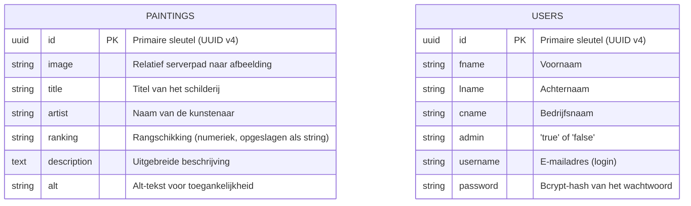

# Opdracht 2 — Backend Ontwerp

## Nevil's Gallery — Analyse, Requirements & Architectuurkeuzes

---

## 1. Projectcontext & Opdrachtgever

**Applicatie:** Nevil's Gallery  
**Beschrijving:** Een digitale galerij-applicatie voor het beheren en presenteren van een curatieve schilderijencollectie van 20 beroemde meesterwerken. Bezoekers kunnen de collectie verkennen; beheerders kunnen na inloggen schilderijen toevoegen, bewerken, verwijderen en de dataset resetten.

**Stakeholders:**
- Eindgebruikers (kunstliefhebbers, studenten, casual bezoekers)
- Galerij-beheerders (onderhoud van de collectie, na authenticatie)
- Ontwikkelaar / opdrachtgever (Nevil Douglas, Haagse Hogeschool)

---

## 2. Requirements

### 2.1 MoSCoW Prioritering

#### Must Have (verplicht)
| ID  | Requirement                                                           | Status |
|-----|-----------------------------------------------------------------------|--------|
| M01 | De API biedt CRUD-functionaliteit voor schilderijen                  | ✅ Geïmplementeerd |
| M02 | Schilderijen worden permanent opgeslagen in een PostgreSQL-database  | ✅ Geïmplementeerd |
| M03 | Afbeeldingen van schilderijen kunnen worden geüpload via de API     | ✅ Geïmplementeerd |
| M04 | De API retourneert consistente JSON-responses                        | ✅ Geïmplementeerd |
| M05 | De backend is gedocumenteerd via Swagger/OpenAPI 3.0                 | ✅ Geïmplementeerd |
| M06 | De backend is bereikbaar via een publieke URL (Azure)                | ✅ Geïmplementeerd |
| M07 | De applicatie gebruikt omgevingsvariabelen voor gevoelige data       | ✅ Geïmplementeerd |

#### Should Have (gewenst)
| ID  | Requirement                                                               | Status |
|-----|---------------------------------------------------------------------------|--------|
| S01 | Ranking-beheer: toevoegen/bewerken van ranking past andere rankings aan  | ✅ Geïmplementeerd |
| S02 | De dataset kan worden gereset naar de originele 20 schilderijen          | ✅ Geïmplementeerd |
| S03 | UUID-validatie op alle ID-parameters                                      | ✅ Geïmplementeerd |
| S04 | De backend ondersteunt CORS voor de Azure Static Web Apps frontend       | ✅ Geïmplementeerd |
| S05 | Afbeeldingen van verwijderde schilderijen worden van de server verwijderd | ✅ Geïmplementeerd |

#### Could Have (wenselijk)
| ID  | Requirement                                                            | Status |
|-----|------------------------------------------------------------------------|--------|
| C01 | Gebruikersauthenticatie voor beheerders                               | ✅ Geïmplementeerd |
| C02 | Rate limiting om misbruik te voorkomen                                | ✅ Geïmplementeerd |
| C03 | Logging naar een externe service                                      | ❌ Gepland |
| C04 | Paginering op de GET /api/paintings endpoint                         | ❌ Gepland |

#### Won't Have (bewust buiten scope)
| ID  | Requirement                                                           |
|-----|-----------------------------------------------------------------------|
| W01 | Betalingsfunctionaliteit                                              |
| W02 | Multi-tenancy (meerdere galerijen per gebruiker)                     |
| W03 | Real-time updates via WebSockets                                      |

---

## 3. API Ontwerp

### 3.1 Overzicht Endpoints

| Methode  | Endpoint                    | Beschrijving                                           | Auth vereist |
|----------|-----------------------------|--------------------------------------------------------|--------------|
| `GET`    | `/api/paintings`            | Haal alle schilderijen op (gesorteerd op ranking)     | Nee          |
| `GET`    | `/api/paintings/:id`        | Haal één schilderij op via UUID                       | Nee          |
| `POST`   | `/api/paintings`            | Voeg een nieuw schilderij toe                         | Ja (JWT)     |
| `PUT`    | `/api/paintings/:id`        | Werk een bestaand schilderij bij                      | Ja (JWT)     |
| `DELETE` | `/api/paintings/:id`        | Verwijder een schilderij                              | Ja (JWT)     |
| `POST`   | `/api/paintings/reset`      | Reset de dataset naar de originele 20 schilderijen    | Ja (JWT)     |
| `POST`   | `/api/auth/login`           | Inloggen — retourneert JWT-token                      | Nee          |

### 3.2 Request/Response Formats

#### GET /api/paintings
**Request:** Geen body vereist.

**Response 200 OK:**
```json
[
  {
    "id": "671fa6fd-da4a-4d28-b4f4-065e7500ece7",
    "image": "/assets/img/initials/The_Mona_Lisa.jpg",
    "title": "The Mona Lisa",
    "artist": "Leonardo da Vinci",
    "ranking": "1",
    "description": "Any list of Most Famous paintings would be..."
  }
]
```

---

#### POST /api/auth/login
**Request:** `application/json`

```json
{
  "username": "admin@example.com",
  "password": "passwordadmin"
}
```

**Response 200 OK:**
```json
{
  "token": "eyJhbGciOiJIUzI1NiIsInR5cCI6IkpXVCJ9...",
  "user": {
    "id": "5f74c3f0-...",
    "username": "admin@example.com",
    "name": "Administrator",
    "isAdmin": true
  }
}
```

**Response 401 (ongeldige credentials):**
```json
{ "error": "Ongeldige inloggegevens." }
```

---

### 3.3 Error Handling Strategie

| HTTP Status | Gebruik                                               |
|-------------|-------------------------------------------------------|
| 200         | Succesvolle GET of PUT                               |
| 201         | Succesvolle POST (aanmaken)                          |
| 204         | Succesvolle DELETE (geen inhoud)                     |
| 400         | Ongeldige invoer (bijv. invalid UUID format)         |
| 401         | Niet geautoriseerd (ontbrekend of ongeldig JWT)      |
| 404         | Resource niet gevonden                               |
| 500         | Interne serverfout (database, bestandssysteem, etc.) |

---

## 4. Data Model & Dataopslag

### 4.1 Keuze: PostgreSQL met Sequelize ORM

**Waarom PostgreSQL?**
- Robuuste, volwassen relationele database met sterke ACID-garanties.
- Uitstekende UUID-ondersteuning.
- Beschikbaar via Neon (gratis cloud PostgreSQL).
- Ondersteunt schema-namespacing (`schema_nevils_gallery`).

**Waarom Sequelize ORM?**
- Abstractie over ruwe SQL — minder kans op SQL-injectie.
- Model-definitie in JavaScript.
- `sequelize.sync()` maakt tabellen automatisch aan bij eerste opstart.

### 4.2 ER-Diagram (Mermaid)



### 4.3 Database Schema Details

- **Schema naam:** `schema_nevils_gallery`
- **Tabellen:** `paintings`, `users`
- **Primary key:** UUID (gegenereerd via Node.js `crypto.randomUUID()`)
- **Timestamps:** Uitgeschakeld (`timestamps: false`)
- **Database hosting:** Neon PostgreSQL (cloud, gratis tier)

### 4.4 Databaseverbinding

```
Productie (Azure):  DATABASE_URL (SSL, sslmode=require)
Lokaal:             DB_HOST, DB_PORT, DB_USER, DB_PASSWORD, DB_DATABASE
```

---

## 5. Securitymaatregelen (ontwerp)

| Maatregel                     | Type       | Status           |
|-------------------------------|------------|------------------|
| Omgevingsvariabelen (.env)    | Preventief | ✅ Geïmplementeerd |
| UUID-validatie middleware     | Preventief | ✅ Geïmplementeerd |
| Sequelize ORM (SQL-injectie)  | Preventief | ✅ Geïmplementeerd |
| CORS-configuratie             | Preventief | ✅ Geïmplementeerd |
| HTTPS via Azure               | Preventief | ✅ Geïmplementeerd |
| Bevestigingsmodal (delete)    | Preventief | ✅ Geïmplementeerd |
| Gebruikersauthenticatie (JWT) | Preventief | ✅ Geïmplementeerd |
| Wachtwoord-hashing (bcrypt)   | Preventief | ✅ Geïmplementeerd |
| Rate limiting                 | Preventief | ✅ Geïmplementeerd |
| Security headers (Helmet.js)  | Preventief | ✅ Geïmplementeerd |

---

## 6. Technologiekeuzes Backend

| Technologie        | Keuze          | Motivatie                                                    |
|--------------------|----------------|--------------------------------------------------------------|
| Runtime            | Node.js        | JavaScript full-stack, grote community                       |
| Framework          | Express.js     | Minimalistisch, flexibel, opdrachtvereiste                   |
| Database           | PostgreSQL     | Robuust, ACID-garanties, beschikbaar via Neon               |
| ORM                | Sequelize v6   | Abstractie, modeldefinitie in JS, parameterized queries      |
| Authenticatie      | JWT + bcryptjs | Stateless, veilig, industriestandaard                        |
| Bestandsupload     | Multer         | Industriestandaard voor multipart/form-data in Express       |
| API-documentatie   | Swagger/OpenAPI 3.0 | Interactieve documentatie, opdrachtvereiste            |
| Omgevingsvariabelen| dotenv         | Veilig scheiden van code en configuratie                     |
| Deployment         | Azure App Service (Basic B1) | Betrouwbaar, geen dagelijkse CPU-limiet      |

---

## 7. Swagger / OpenAPI Documentatie

De Swagger-documentatie is beschikbaar op:
- **Lokaal:** `http://localhost:4000/api-docs`
- **Productie (Azure):** `https://nevils-gallery-api-2-f4haftfbf2gheggu.westeurope-01.azurewebsites.net/api-docs`
- **Productie (Heroku):** `https://nevils-gallery-api-456cfdb93e97.herokuapp.com/api-docs`
