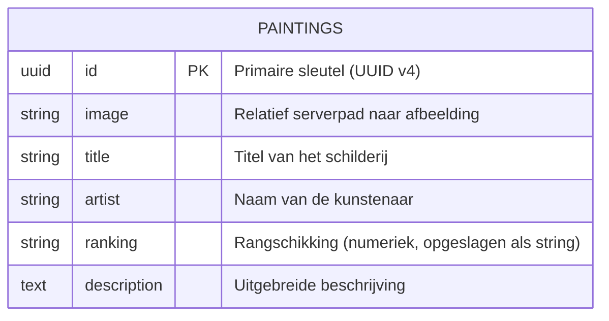

# Opdracht 2 — Backend Ontwerp

## Nevil's Gallery — Analyse, Requirements & Architectuurkeuzes

---

## 1. Projectcontext & Opdrachtgever

**Applicatie:** Nevil's Gallery  
**Beschrijving:** Een digitale galerij-applicatie voor het beheren en presenteren van een curatieve schilderijencollectie van 20 beroemde meesterwerken. Bezoekers kunnen de collectie verkennen; beheerders kunnen schilderijen toevoegen, bewerken, verwijderen en de dataset resetten.

**Stakeholders:**
- Eindgebruikers (kunstliefhebbers, studenten, casual bezoekers)
- Galerij-beheerders (onderhoud van de collectie)
- Ontwikkelaar / opdrachtgever (Nevil Douglas, Haagse Hogeschool)

---

## 2. Requirements

### 2.1 MoSCoW Prioritering

#### Must Have (verplicht)
| ID  | Requirement                                                           |
|-----|-----------------------------------------------------------------------|
| M01 | De API biedt CRUD-functionaliteit voor schilderijen                  |
| M02 | Schilderijen worden permanent opgeslagen in een PostgreSQL-database  |
| M03 | Afbeeldingen van schilderijen kunnen worden geüpload via de API     |
| M04 | De API retourneert consistente JSON-responses                        |
| M05 | De backend is gedocumenteerd via Swagger/OpenAPI 3.0                 |
| M06 | De backend is bereikbaar via een publieke URL (Heroku)               |
| M07 | De applicatie gebruikt omgevingsvariabelen voor gevoelige data       |

#### Should Have (gewenst)
| ID  | Requirement                                                               |
|-----|---------------------------------------------------------------------------|
| S01 | Ranking-beheer: toevoegen/bewerken van ranking past andere rankings aan  |
| S02 | De dataset kan worden gereset naar de originele 20 schilderijen          |
| S03 | UUID-validatie op alle ID-parameters                                      |
| S04 | De backend ondersteunt CORS voor de Netlify/React frontend               |
| S05 | Afbeeldingen van verwijderde schilderijen worden van de server verwijderd |

#### Could Have (wenselijk)
| ID  | Requirement                                                            |
|-----|------------------------------------------------------------------------|
| C01 | Gebruikersauthenticatie voor beheerders                               |
| C02 | Rate limiting om misbruik te voorkomen                                |
| C03 | Logging naar een externe service (bijv. Papertrail op Heroku)        |
| C04 | Paginering op de GET /api/paintings endpoint                         |

#### Won't Have (bewust buiten scope)
| ID  | Requirement                                                           |
|-----|-----------------------------------------------------------------------|
| W01 | Betalingsfunctionaliteit                                              |
| W02 | Multi-tenancy (meerdere galerijen per gebruiker)                     |
| W03 | Real-time updates via WebSockets                                      |

---

## 3. API Ontwerp

### 3.1 Overzicht Endpoints

| Methode  | Endpoint                    | Beschrijving                                           | Auth vereist |
|----------|-----------------------------|--------------------------------------------------------|--------------|
| `GET`    | `/api/paintings`            | Haal alle schilderijen op (gesorteerd op ranking)     | Nee          |
| `GET`    | `/api/paintings/:id`        | Haal één schilderij op via UUID                       | Nee          |
| `POST`   | `/api/paintings`            | Voeg een nieuw schilderij toe                         | (toekomst)   |
| `PUT`    | `/api/paintings/:id`        | Werk een bestaand schilderij bij                      | (toekomst)   |
| `DELETE` | `/api/paintings/:id`        | Verwijder een schilderij                              | (toekomst)   |
| `POST`   | `/api/paintings/reset`      | Reset de dataset naar de originele 20 schilderijen    | (toekomst)   |

### 3.2 Request/Response Formats

#### GET /api/paintings
**Request:** Geen body vereist.

**Response 200 OK:**
```json
[
  {
    "id": "671fa6fd-da4a-4d28-b4f4-065e7500ece7",
    "image": "/assets/img/initials/The_Mona_Lisa.jpg",
    "title": "The Mona Lisa",
    "artist": "Leonardo da Vinci",
    "ranking": "1",
    "description": "Any list of Most Famous paintings would be..."
  },
  { ... }
]
```

**Response 500:**
```json
{ "error": "Interne serverfout" }
```

---

#### GET /api/paintings/:id
**Request:** UUID als URL-parameter.

**Response 200 OK:**
```json
{
  "id": "671fa6fd-da4a-4d28-b4f4-065e7500ece7",
  "image": "/assets/img/initials/The_Mona_Lisa.jpg",
  "title": "The Mona Lisa",
  "artist": "Leonardo da Vinci",
  "ranking": "1",
  "description": "Any list of Most Famous paintings..."
}
```

**Response 400 (ongeldig UUID):**
```json
{ "error": "Invalid UUID format" }
```

**Response 404:**
```json
{ "error": "Painting not found" }
```

---

#### POST /api/paintings
**Request:** `multipart/form-data`

| Veld          | Type     | Verplicht | Beschrijving                        |
|---------------|----------|-----------|-------------------------------------|
| `title`       | string   | Ja        | Titel van het schilderij            |
| `artist`      | string   | Ja        | Naam van de kunstenaar              |
| `ranking`     | integer  | Nee       | Rangschikking (geheel getal)        |
| `description` | string   | Ja        | Beschrijving van het schilderij     |
| `imageFile`   | bestand  | Nee       | JPEG/PNG afbeelding (max. Multer)   |

**Response 201 Created:**
```json
{
  "id": "a1b2c3d4-...",
  "image": "/assets/img/painting-1712345678901.jpg",
  "title": "Nieuw Schilderij",
  "artist": "Kunstenaar Naam",
  "ranking": "3",
  "description": "Beschrijving..."
}
```

---

#### PUT /api/paintings/:id
**Request:** `multipart/form-data` (dezelfde velden als POST, allemaal optioneel)

**Response 200 OK:** Bijgewerkt schilderij (zelfde schema als GET by ID)

**Response 400:** Ongeldig UUID  
**Response 404:** Schilderij niet gevonden  
**Response 500:** Serverfout

---

#### DELETE /api/paintings/:id
**Request:** UUID als URL-parameter, geen body.

**Response 204 No Content:** Leeg — schilderij succesvol verwijderd.  
**Response 400:** Ongeldig UUID  
**Response 404:** Schilderij niet gevonden

---

#### POST /api/paintings/reset
**Request:** Geen body.

**Response 200 OK:**
```json
{ "message": "Database is succesvol gereset naar de originele 20 schilderijen." }
```

**Response 500:**
```json
{ "error": "Er is een fout opgetreden bij het resetten van de dataset." }
```

---

### 3.3 Error Handling Strategie

| HTTP Status | Gebruik                                               |
|-------------|-------------------------------------------------------|
| 200         | Succesvolle GET of PUT                               |
| 201         | Succesvolle POST (aanmaken)                          |
| 204         | Succesvolle DELETE (geen inhoud)                     |
| 400         | Ongeldige invoer (bijv. invalid UUID format)         |
| 404         | Resource niet gevonden                               |
| 500         | Interne serverfout (database, bestandssysteem, etc.) |

Alle foutresponses volgen het formaat:
```json
{ "error": "Beschrijving van de fout" }
```

---

## 4. Data Model & Dataopslag

### 4.1 Keuze: PostgreSQL met Sequelize ORM

**Waarom PostgreSQL?**
- Robuuste, volwassen relationele database met sterke ACID-garanties.
- Uitstekende UUID-ondersteuning (native `uuid` type).
- Gratis beschikbaar via Heroku Postgres add-on.
- Ondersteunt schema-namespacing (`schema_nevils_gallery`), wat logische scheiding biedt.

**Waarom Sequelize ORM?**
- Abstractie over ruwe SQL — minder kans op SQL-injectie via de ORM-laag.
- Model-definitie in JavaScript, geen aparte migratiescripts nodig voor eenvoudige schema's.
- `sequelize.sync()` maakt tabellen automatisch aan bij eerste opstart.
- Parameterized queries via `replacements` voor ruwe SQL-aanroepen.

### 4.2 ER-Diagram (Mermaid)



> **Toelichting:** Het schema bevat bewust één tabel. De applicatie beheert een curatieve collectie zonder relaties naar andere entiteiten (zoals kunstenaars of categorieën). Bij uitbreiding kan een `ARTISTS`-tabel worden toegevoegd met een foreign key.

### 4.3 Database Schema Details

- **Schema naam:** `schema_nevils_gallery`
- **Tabel naam:** `paintings`
- **Primary key:** UUID (gegenereerd via Node.js `crypto.randomUUID()`)
- **Timestamps:** Uitgeschakeld (`timestamps: false`) — de applicatie heeft geen aanmaak- of wijzigingsdatum nodig.
- **Ranking als string:** De ranking is opgeslagen als `STRING` voor maximale flexibiliteit, maar wordt numeriek vergeleken via SQL-casting (`CAST(ranking AS INTEGER)`).

### 4.4 Databaseverbinding

```
Productie (Heroku):  DATABASE_URL (SSL, rejectUnauthorized: false)
Lokaal:              DB_HOST, DB_PORT, DB_USER, DB_PASSWORD, DB_DATABASE
```

De verbinding wordt geconfigureerd in `backend/config/database.js` en bij serverstart geverifieerd via `sequelize.authenticate()`.

---

## 5. Securitymaatregelen (ontwerp)

> *Gedetailleerde uitwerking in Opdracht 4. Hier een samenvatting van de geplande maatregelen.*

| Maatregel                     | Type       | Status           |
|-------------------------------|------------|------------------|
| Omgevingsvariabelen (.env)    | Preventief | Geïmplementeerd  |
| UUID-validatie middleware     | Preventief | Geïmplementeerd  |
| Sequelize ORM (SQL-injectie)  | Preventief | Geïmplementeerd  |
| CORS-configuratie             | Preventief | Geïmplementeerd  |
| HTTPS via Heroku              | Preventief | Geïmplementeerd  |
| Bevestigingsmodal (delete)    | Preventief | Geïmplementeerd  |
| Gebruikersauthenticatie       | Preventief | **Gepland**      |
| Rate limiting                 | Preventief | **Gepland**      |
| Inputvalidatie (Joi/express-validator) | Preventief | **Gepland** |
| Security headers (Helmet.js)  | Preventief | **Gepland**      |

---

## 6. Technologiekeuzes Backend

| Technologie        | Keuze          | Motivatie                                                    |
|--------------------|----------------|--------------------------------------------------------------|
| Runtime            | Node.js        | JavaScript full-stack, grote community, Heroku-ready         |
| Framework          | Express.js     | Minimalistisch, flexibel, opdrachtvereiste                   |
| Database           | PostgreSQL     | Robuust, gratis op Heroku, ACID-garanties                    |
| ORM                | Sequelize v6   | Abstractie, modeldefinitie in JS, parameterized queries      |
| Bestandsupload     | Multer         | Industriestandaard voor multipart/form-data in Express       |
| API-documentatie   | Swagger/OpenAPI 3.0 | Interactieve documentatie, opdrachtvereiste            |
| Omgevingsvariabelen| dotenv         | Veilig scheiden van code en configuratie                     |
| Processen          | nodemon (dev)  | Automatisch herstarten bij code-wijzigingen                  |

---

## 7. Swagger / OpenAPI Documentatie

De Swagger-documentatie is beschikbaar op:
- **Lokaal:** `http://localhost:4000/api-docs`
- **Productie:** `https://nevils-gallery-api-456cfdb93e97.herokuapp.com/api-docs`

De specificatie is gegenereerd via `swagger-jsdoc` op basis van JSDoc `@swagger`-annotaties in `backend/routes/painting.routes.js`, geconfigureerd in `backend/swagger.js`.
