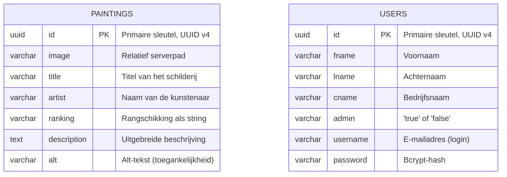

# Opdracht 3 — Backend Prototypes & CRUD API Documentatie

## Nevil's Gallery — ERD Diagram & API Documentatie

---

## 1. Inleiding

Dit document bevat het ontwerp van de backend van Nevil's Gallery, inclusief het ERD-diagram en een volledige CRUD API-documentatie. De API is gebouwd met Express.js en gedocumenteerd via OpenAPI 3.0 (Swagger).

De interactieve Swagger-documentatie is live beschikbaar op:  
- **Azure (primair):** `https://nevils-gallery-api-2-f4haftfbf2gheggu.westeurope-01.azurewebsites.net/api-docs`
- **Heroku (alternatief):** `https://nevils-gallery-api-456cfdb93e97.herokuapp.com/api-docs`

---

## 2. ERD Diagram

### 2.1 Huidige Datastructuur

```
┌────────────────────────────────────────────────────────────┐
│                  schema_nevils_gallery                     │
│                                                            │
│  ┌──────────────────────────────────────────────────────┐  │
│  │                    paintings                         │  │
│  ├──────────────────┬───────────────┬───────────────────┤  │
│  │ Kolom            │ Type          │ Constraint        │  │
│  ├──────────────────┼───────────────┼───────────────────┤  │
│  │ id               │ UUID          │ PRIMARY KEY       │  │
│  │ image            │ VARCHAR(255)  │ NULLABLE          │  │
│  │ title            │ VARCHAR(255)  │ NULLABLE          │  │
│  │ artist           │ VARCHAR(255)  │ NULLABLE          │  │
│  │ ranking          │ VARCHAR(255)  │ NULLABLE          │  │
│  │ description      │ TEXT          │ NULLABLE          │  │
│  │ alt              │ VARCHAR(255)  │ NULLABLE          │  │
│  └──────────────────┴───────────────┴───────────────────┘  │
│                                                            │
│  ┌──────────────────────────────────────────────────────┐  │
│  │                      users                          │  │
│  ├──────────────────┬───────────────┬───────────────────┤  │
│  │ id               │ UUID          │ PRIMARY KEY       │  │
│  │ fname            │ VARCHAR(50)   │ NULLABLE          │  │
│  │ lname            │ VARCHAR(50)   │ NULLABLE          │  │
│  │ cname            │ VARCHAR(50)   │ NULLABLE          │  │
│  │ admin            │ VARCHAR(50)   │ NULLABLE          │  │
│  │ username         │ VARCHAR(100)  │ NOT NULL          │  │
│  │ password         │ VARCHAR(255)  │ NOT NULL (bcrypt) │  │
│  └──────────────────┴───────────────┴───────────────────┘  │
└────────────────────────────────────────────────────────────┘
```

### 2.2 Mermaid ERD



---

## 3. Systeemarchitectuur

```
┌─────────────────────┐    HTTPS     ┌──────────────────────────────┐
│   React Frontend    │◄────────────►│   Express.js Backend         │
│   (Azure SWA)       │              │   (Azure App Service)        │
│                     │              │                              │
│  - HomePage         │   REST API   │  /api/paintings  ──► routes  │
│  - MainTablePage    │   JSON       │  /api/auth       ──► routes  │
│  - LoginPage        │              │  /api-docs       ──► swagger │
│  - MaintenancePage  │              │  /assets/img     ──► static  │
│  - AboutPage        │              │                              │
└─────────────────────┘              │  ┌──────────────────────┐    │
                                     │  │   Sequelize ORM      │    │
                                     │  │   painting.model.js  │    │
                                     │  │   user.model.js      │    │
                                     │  └──────────┬───────────┘    │
                                     └─────────────┼────────────────┘
                                                   │ PostgreSQL (SSL)
                                     ┌─────────────▼────────────────┐
                                     │   Neon PostgreSQL (cloud)    │
                                     │   schema_nevils_gallery      │
                                     │   ├── paintings (tabel)      │
                                     │   └── users (tabel)          │
                                     └──────────────────────────────┘
```

---

## 4. CRUD API — Volledige Documentatie

### 4.1 Basis URL

| Omgeving   | URL                                                                                        |
|------------|--------------------------------------------------------------------------------------------|
| Productie (Azure)  | `https://nevils-gallery-api-2-f4haftfbf2gheggu.westeurope-01.azurewebsites.net`   |
| Productie (Heroku) | `https://nevils-gallery-api-456cfdb93e97.herokuapp.com`                            |
| Lokaal             | `http://localhost:4000`                                                             |

### 4.2 Painting Object Schema

```json
{
  "id":          "string (UUID v4)",
  "image":       "string (serverpad) | null",
  "title":       "string | null",
  "artist":      "string | null",
  "ranking":     "string (numeriek) | null",
  "description": "string | null",
  "alt":         "string | null"
}
```

### 4.3 Authenticatie

Beveiligde endpoints vereisen een geldig JWT-token in de `Authorization` header:

```http
Authorization: Bearer <token>
```

Het token wordt verkregen via `POST /api/auth/login`.

---

### Auth Endpoint: Inloggen

```
POST /api/auth/login
Content-Type: application/json
```

**Request Body:**
```json
{
  "username": "admin@example.com",
  "password": "passwordadmin"
}
```

**Response 200 OK:**
```json
{
  "token": "eyJhbGciOiJIUzI1NiIsInR5cCI6IkpXVCJ9...",
  "user": {
    "id": "5f74c3f0-d550-439d-8d67-4aaa1ee92c2a",
    "username": "admin@example.com",
    "name": "Administrator",
    "isAdmin": true
  }
}
```

**Response 401:**
```json
{ "error": "Ongeldige inloggegevens." }
```

---

### CRUD Endpoint 1: Alle schilderijen ophalen

```
GET /api/paintings
```

**Voorbeeld Request:**
```http
GET /api/paintings HTTP/1.1
Host: nevils-gallery-api-2-f4haftfbf2gheggu.westeurope-01.azurewebsites.net
Accept: application/json
```

**Response 200 OK:** Array van schilderijen, gesorteerd op ranking ASC.

---

### CRUD Endpoint 2: Één schilderij ophalen

```
GET /api/paintings/:id
```

**Response 200:** Schilderij-object  
**Response 400:** `{ "error": "Invalid UUID format" }`  
**Response 404:** `{ "error": "Painting not found" }`

---

### CRUD Endpoint 3: Nieuw schilderij aanmaken

```
POST /api/paintings
Content-Type: multipart/form-data
Authorization: Bearer <token>
```

**Voorbeeld Request (curl):**
```bash
curl -X POST https://nevils-gallery-api-2-f4haftfbf2gheggu.westeurope-01.azurewebsites.net/api/paintings \
  -H "Authorization: Bearer <token>" \
  -F "title=The Birth of Venus" \
  -F "artist=Sandro Botticelli" \
  -F "ranking=5" \
  -F "description=Painted circa 1484-1486..." \
  -F "imageFile=@/path/to/botticelli.jpg"
```

**Response 201 Created:** Nieuw schilderij-object  
**Response 401:** Niet ingelogd

---

### CRUD Endpoint 4: Schilderij bijwerken

```
PUT /api/paintings/:id
Content-Type: multipart/form-data
Authorization: Bearer <token>
```

**Response 200:** Bijgewerkt schilderij  
**Response 400/401/404:** Fout

---

### CRUD Endpoint 5: Schilderij verwijderen

```
DELETE /api/paintings/:id
Authorization: Bearer <token>
```

**Response 204:** Succesvol verwijderd  
**Response 400/401/404:** Fout

---

### Extra Endpoint: Dataset resetten

```
POST /api/paintings/reset
Authorization: Bearer <token>
```

**Response 200 OK:**
```json
{ "message": "Database is succesvol gereset naar de originele 20 schilderijen." }
```

---

## 5. Middleware Documentatie

### 5.1 validateUUID

```javascript
const uuidRegex = /^[0-9a-f]{8}-[0-9a-f]{4}-[1-5][0-9a-f]{3}-[89ab][0-9a-f]{3}-[0-9a-f]{12}$/i;
```

Toegepast op: GET `/:id`, PUT `/:id`, DELETE `/:id`

### 5.2 authenticateToken (auth.middleware.js)

```javascript
const token = req.headers['authorization']?.split(' ')[1];
req.user = jwt.verify(token, process.env.JWT_SECRET);
```

Toegepast op: POST `/`, PUT `/:id`, DELETE `/:id`, POST `/reset`

### 5.3 upload (middleware/upload.js)

Verwerkt `multipart/form-data` via Multer. Bestandsnaam: `painting-{timestamp}{extensie}`.

---

## 6. Statuscodematrix

| Endpoint                    | 200 | 201 | 204 | 400 | 401 | 404 | 500 |
|-----------------------------|-----|-----|-----|-----|-----|-----|-----|
| POST /api/auth/login        | ✓   |     |     | ✓   | ✓   |     | ✓   |
| GET /api/paintings          | ✓   |     |     |     |     |     | ✓   |
| GET /api/paintings/:id      | ✓   |     |     | ✓   |     | ✓   | ✓   |
| POST /api/paintings         |     | ✓   |     |     | ✓   |     | ✓   |
| PUT /api/paintings/:id      | ✓   |     |     | ✓   | ✓   | ✓   | ✓   |
| DELETE /api/paintings/:id   |     |     | ✓   | ✓   | ✓   | ✓   | ✓   |
| POST /api/paintings/reset   | ✓   |     |     |     | ✓   |     | ✓   |
