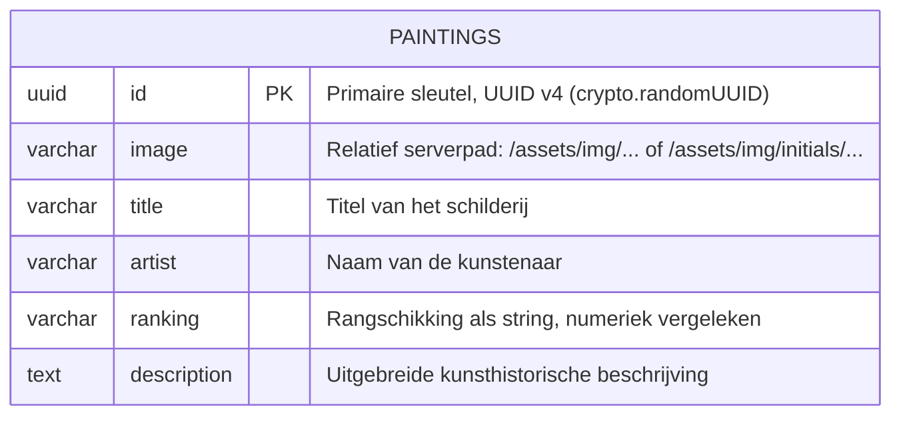
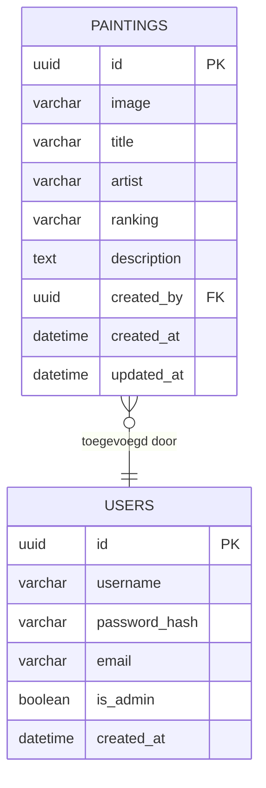

# Opdracht 3 — Backend Prototypes & CRUD API Documentatie

## Nevil's Gallery — ERD Diagram & API Documentatie

---

## 1. Inleiding

Dit document bevat het ontwerp van de backend van Nevil's Gallery, inclusief het ERD-diagram en een volledige CRUD API-documentatie. De API is gebouwd met Express.js en gedocumenteerd via OpenAPI 3.0 (Swagger).

De interactieve Swagger-documentatie is live beschikbaar op:  
**`https://nevils-gallery-api-456cfdb93e97.herokuapp.com/api-docs`**

---

## 2. ERD Diagram

### 2.1 Huidige Datastructuur

```
┌─────────────────────────────────────────────────────────────┐
│                  schema_nevils_gallery                       │
│                                                             │
│  ┌──────────────────────────────────────────────────────┐  │
│  │                    paintings                          │  │
│  ├──────────────────┬───────────────┬───────────────────┤  │
│  │ Kolom            │ Type          │ Constraint        │  │
│  ├──────────────────┼───────────────┼───────────────────┤  │
│  │ id               │ UUID          │ PRIMARY KEY       │  │
│  │ image            │ VARCHAR(255)  │ NULLABLE          │  │
│  │ title            │ VARCHAR(255)  │ NULLABLE          │  │
│  │ artist           │ VARCHAR(255)  │ NULLABLE          │  │
│  │ ranking          │ VARCHAR(255)  │ NULLABLE          │  │
│  │ description      │ TEXT          │ NULLABLE          │  │
│  └──────────────────┴───────────────┴───────────────────┘  │
│                                                             │
└─────────────────────────────────────────────────────────────┘
```

### 2.2 Mermaid ERD (uitgebreid ontwerp)



### 2.3 Toekomstig uitgebreid datamodel (bij authenticatie)



> **Toelichting:** De `USERS`-tabel bestaat al in de database-dump (`dump.sql`), maar is nog niet gekoppeld aan de actieve API. De foreign key `created_by` is een toekomstige uitbreiding.

---

## 3. Systeemarchitectuur

```
┌─────────────────────┐    HTTPS     ┌──────────────────────────────┐
│   React Frontend    │◄────────────►│   Express.js Backend         │
│   (Netlify)         │              │   (Heroku)                   │
│                     │              │                              │
│  - HomePage         │   REST API   │  /api/paintings  ──► routes  │
│  - MainTablePage    │   JSON       │  /api-docs       ──► swagger │
│  - MaintenancePage  │              │  /assets/img     ──► static  │
│  - AboutPage        │              │                              │
└─────────────────────┘              │  ┌──────────────────────┐   │
                                     │  │   Sequelize ORM      │   │
                                     │  │   painting.model.js  │   │
                                     │  └──────────┬───────────┘   │
                                     │             │               │
                                     └─────────────┼───────────────┘
                                                   │ PostgreSQL
                                     ┌─────────────▼───────────────┐
                                     │   Heroku PostgreSQL          │
                                     │   schema_nevils_gallery      │
                                     │   └── paintings (tabel)      │
                                     └─────────────────────────────┘
```

---

## 4. CRUD API — Volledige Documentatie

### 4.1 Basis URL

| Omgeving   | URL                                                        |
|------------|------------------------------------------------------------|
| Productie  | `https://nevils-gallery-api-456cfdb93e97.herokuapp.com`   |
| Lokaal     | `http://localhost:4000`                                    |

### 4.2 Painting Object Schema

```json
{
  "id":          "string (UUID v4)",
  "image":       "string (serverpad) | null",
  "title":       "string | null",
  "artist":      "string | null",
  "ranking":     "string (numeriek) | null",
  "description": "string | null"
}
```

### 4.3 Error Object Schema

```json
{
  "error": "string (beschrijving van de fout)"
}
```

---

### CRUD Endpoint 1: Alle schilderijen ophalen

```
GET /api/paintings
```

**Beschrijving:** Haalt de volledige collectie op, gesorteerd op ranking (oplopend).

**Parameters:** Geen

**Headers:** Geen vereist

**Voorbeeld Request:**
```http
GET /api/paintings HTTP/1.1
Host: nevils-gallery-api-456cfdb93e97.herokuapp.com
Accept: application/json
```

**Voorbeeld Response (200 OK):**
```json
[
  {
    "id": "671fa6fd-da4a-4d28-b4f4-065e7500ece7",
    "image": "/assets/img/initials/The_Mona_Lisa.jpg",
    "title": "The Mona Lisa",
    "artist": "Leonardo da Vinci",
    "ranking": "1",
    "description": "Any list of Most Famous paintings would be incomplete without..."
  },
  {
    "id": "d8694e59-309f-4d56-a0d6-da82d921b0eb",
    "image": "/assets/img/initials/Starry_Night.jpg",
    "title": "Starry Night",
    "artist": "Vincent van Gogh",
    "ranking": "2",
    "description": "Vincent van Gogh has painted countless well-known pieces..."
  }
]
```

**Foutrespons (500):**
```json
{ "error": "Interne serverfout" }
```

**Implementatie:** `painting.controller.js:16` — `getAllPaintings()`

---

### CRUD Endpoint 2: Één schilderij ophalen

```
GET /api/paintings/:id
```

**Beschrijving:** Haalt één schilderij op via zijn UUID.

**URL Parameter:**

| Parameter | Type   | Verplicht | Beschrijving             |
|-----------|--------|-----------|--------------------------|
| `id`      | UUID   | Ja        | UUID van het schilderij  |

**Validatie:** UUID wordt gevalideerd door de `validateUUID` middleware (`painting.routes.js:22`) vóór de controller wordt aangeroepen.

**Voorbeeld Request:**
```http
GET /api/paintings/671fa6fd-da4a-4d28-b4f4-065e7500ece7 HTTP/1.1
Host: nevils-gallery-api-456cfdb93e97.herokuapp.com
```

**Voorbeeld Response (200 OK):**
```json
{
  "id": "671fa6fd-da4a-4d28-b4f4-065e7500ece7",
  "image": "/assets/img/initials/The_Mona_Lisa.jpg",
  "title": "The Mona Lisa",
  "artist": "Leonardo da Vinci",
  "ranking": "1",
  "description": "Any list of Most Famous paintings..."
}
```

**Foutrespons (400 — ongeldig UUID):**
```json
{ "error": "Invalid UUID format" }
```

**Foutrespons (404 — niet gevonden):**
```json
{ "error": "Painting not found" }
```

**Implementatie:** `painting.controller.js:31` — `getPaintingById()`

---

### CRUD Endpoint 3: Nieuw schilderij aanmaken

```
POST /api/paintings
Content-Type: multipart/form-data
```

**Beschrijving:** Voegt een nieuw schilderij toe aan de collectie. Als een ranking wordt opgegeven, worden alle bestaande schilderijen met een gelijke of hogere ranking automatisch één positie opgeschoven (ranking-shift).

**Request Body (multipart/form-data):**

| Veld          | Type     | Verplicht | Beschrijving                              |
|---------------|----------|-----------|-------------------------------------------|
| `title`       | string   | Aanbevolen | Titel van het schilderij                 |
| `artist`      | string   | Aanbevolen | Naam van de kunstenaar                   |
| `ranking`     | integer  | Nee       | Gewenste ranking (geheel getal)           |
| `description` | string   | Aanbevolen | Beschrijving van het schilderij          |
| `imageFile`   | bestand  | Nee       | Afbeelding (JPEG/PNG)                    |

**Voorbeeld Request (curl):**
```bash
curl -X POST https://nevils-gallery-api-456cfdb93e97.herokuapp.com/api/paintings \
  -F "title=The Birth of Venus" \
  -F "artist=Sandro Botticelli" \
  -F "ranking=5" \
  -F "description=Painted circa 1484-1486 by Sandro Botticelli..." \
  -F "imageFile=@/path/to/botticelli.jpg"
```

**Voorbeeld Response (201 Created):**
```json
{
  "id": "a1b2c3d4-e5f6-7890-abcd-ef1234567890",
  "image": "/assets/img/painting-1712345678901.jpg",
  "title": "The Birth of Venus",
  "artist": "Sandro Botticelli",
  "ranking": "5",
  "description": "Painted circa 1484-1486..."
}
```

**Bijzonderheid — Ranking-shift:**
Als `ranking=5` wordt opgegeven en er zijn al schilderijen op ranking 5, 6, 7, ..., dan worden die automatisch verschoven naar 6, 7, 8, ... zodat het nieuwe schilderij op positie 5 terecht komt.

**Implementatie:** `painting.controller.js:50` — `createPainting()`

---

### CRUD Endpoint 4: Schilderij bijwerken

```
PUT /api/paintings/:id
Content-Type: multipart/form-data
```

**Beschrijving:** Werkt de velden van een bestaand schilderij bij. Bij een rankingwijziging worden andere schilderijen automatisch verschoven (bidirectioneel):
- **Omhoog** (lagere ranking): schilderijen in het bereik gaan één plek omlaag.
- **Omlaag** (hogere ranking): schilderijen in het bereik gaan één plek omhoog.

Als een nieuwe afbeelding wordt geüpload, wordt de oude automatisch verwijderd van de server (tenzij het een initieel schilderij betreft).

**URL Parameter:**

| Parameter | Type   | Verplicht | Beschrijving             |
|-----------|--------|-----------|--------------------------|
| `id`      | UUID   | Ja        | UUID van het schilderij  |

**Request Body:** Dezelfde velden als POST, allemaal optioneel.

**Voorbeeld Request (curl):**
```bash
curl -X PUT https://nevils-gallery-api-456cfdb93e97.herokuapp.com/api/paintings/671fa6fd-da4a-4d28-b4f4-065e7500ece7 \
  -F "ranking=2" \
  -F "description=Updated description..."
```

**Voorbeeld Response (200 OK):**
```json
{
  "id": "671fa6fd-da4a-4d28-b4f4-065e7500ece7",
  "image": "/assets/img/initials/The_Mona_Lisa.jpg",
  "title": "The Mona Lisa",
  "artist": "Leonardo da Vinci",
  "ranking": "2",
  "description": "Updated description..."
}
```

**Implementatie:** `painting.controller.js:94` — `updatePainting()`

---

### CRUD Endpoint 5: Schilderij verwijderen

```
DELETE /api/paintings/:id
```

**Beschrijving:** Verwijdert een schilderij uit de database. Als het schilderij een door de gebruiker geüploade afbeelding heeft (niet uit de `/initials/` map), wordt de afbeelding ook van de server verwijderd.

**URL Parameter:**

| Parameter | Type   | Verplicht | Beschrijving             |
|-----------|--------|-----------|--------------------------|
| `id`      | UUID   | Ja        | UUID van het schilderij  |

**Voorbeeld Request (curl):**
```bash
curl -X DELETE https://nevils-gallery-api-456cfdb93e97.herokuapp.com/api/paintings/671fa6fd-da4a-4d28-b4f4-065e7500ece7
```

**Response (204 No Content):** Geen body — schilderij succesvol verwijderd.

**Implementatie:** `painting.controller.js:169` — `deletePainting()`

---

### Extra Endpoint: Dataset resetten

```
POST /api/paintings/reset
```

**Beschrijving:** Reset de volledige collectie naar de originele 20 beroemde meesterwerken. Alle door gebruikers toegevoegde schilderijen (inclusief hun afbeeldingen) worden verwijderd.

**Stappen die worden uitgevoerd:**
1. Alle schilderijen zonder `/initials/` pad worden gevonden.
2. Hun afbeeldingsbestanden worden van de server verwijderd.
3. De tabel wordt geleegd (`TRUNCATE`).
4. De 20 originele schilderijen worden opnieuw ingevoerd (`bulkCreate`).

**Voorbeeld Response (200 OK):**
```json
{ "message": "Database is succesvol gereset naar de originele 20 schilderijen." }
```

**Implementatie:** `painting.controller.js:222` — `resetPaintings()`

---

## 5. Middleware Documentatie

### 5.1 validateUUID (painting.routes.js:22)

```javascript
const validateUUID = (req, res, next) => {
  const uuidRegex = /^[0-9a-f]{8}-[0-9a-f]{4}-[1-5][0-9a-f]{3}-[89ab][0-9a-f]{3}-[0-9a-f]{12}$/i;
  if (!uuidRegex.test(req.params.id)) {
    return res.status(400).json({ error: 'Invalid UUID format' });
  }
  next();
};
```

**Doel:** Valideert of het `:id` URL-parameter een geldig UUID v1-v5 is.  
**Toegepast op:** GET `/:id`, PUT `/:id`, DELETE `/:id`  
**Foutrespons:** HTTP 400 met `{ "error": "Invalid UUID format" }`

### 5.2 upload (middleware/upload.js)

**Doel:** Verwerkt `multipart/form-data` bestandsuploads via Multer.  
**Veldnaam:** `imageFile`  
**Bestemming:** `backend/public/assets/img/`  
**Bestandsnaam:** `painting-{timestamp}{extensie}` (bijv. `painting-1712345678901.jpg`)  
**Toegepast op:** POST `/`, PUT `/:id`

---

## 6. Routevolgorde (belangrijk)

De route `/reset` is bewust **vóór** `/:id` geregistreerd om te voorkomen dat "reset" als UUID wordt geïnterpreteerd:

```javascript
router.post('/reset', resetPaintings);    // Lijn 82 — vóór /:id
router.get('/:id', validateUUID, ...);   // Lijn 112 — na /reset
```

---

## 7. Statuscodematrix

| Endpoint                    | 200 | 201 | 204 | 400 | 404 | 500 |
|-----------------------------|-----|-----|-----|-----|-----|-----|
| GET /api/paintings          | ✓   |     |     |     |     | ✓   |
| GET /api/paintings/:id      | ✓   |     |     | ✓   | ✓   | ✓   |
| POST /api/paintings         |     | ✓   |     |     |     | ✓   |
| PUT /api/paintings/:id      | ✓   |     |     | ✓   | ✓   | ✓   |
| DELETE /api/paintings/:id   |     |     | ✓   | ✓   | ✓   | ✓   |
| POST /api/paintings/reset   | ✓   |     |     |     |     | ✓   |
